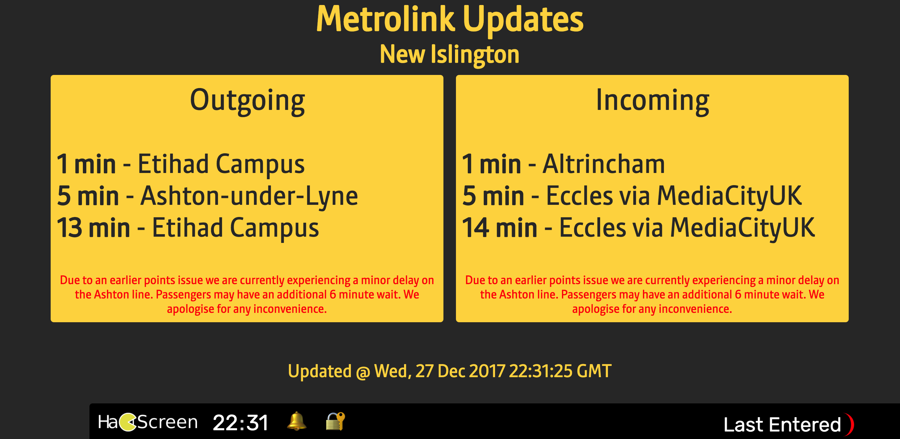

# A TV screen, announcer, noticeboard for hackerspaces
Hackscreen is a full-screen presentational webapp for hackerspaces and public/member areas to show content, status and messages.

## Screenshots
 

## Features
* Fullscreen information for big TVs.
* Rotates continually.
* Customisable screens, ordering, styles, and timing.
* Pulls in live Metrolink data from external APIs.
* Communication between server and clients.
* Add your own screens super easily - anyone can do it with minimal HTML experience
* Smooth animations for maximum enjoy
* Can run on a raspberry pi for super easy setup.
* Party Parrots

## Tech
* create-react-app
* MQTT
* socket.io
* SASS

## Setup
* Clone
* Install `npm install`
* Build `npm run build`
* Run `server/index.js`
  * `node server`
  * I recommend using `pm2` to keep the app alive

## How to add screens
* Create a new screen in `src/screens` - the file name should start with a capital letter
* Add the export for the new screen into index.jsx
* Update the config file to spicify the name of the file, and how long it should show for
* Order shown is the order in the config file
* Add your styles for the new screen in Screens.scss

## Misc
Any issues give me a shout.